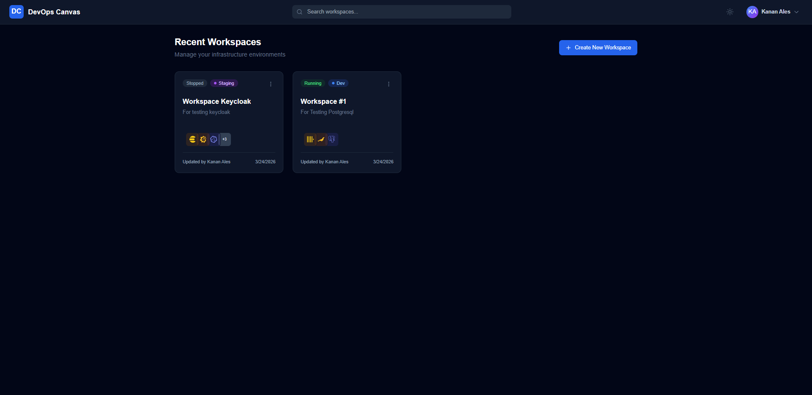
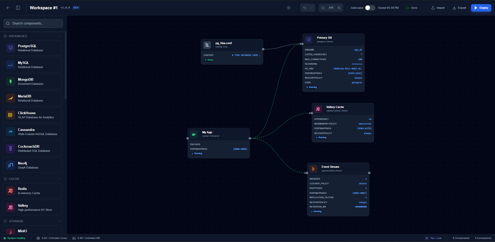
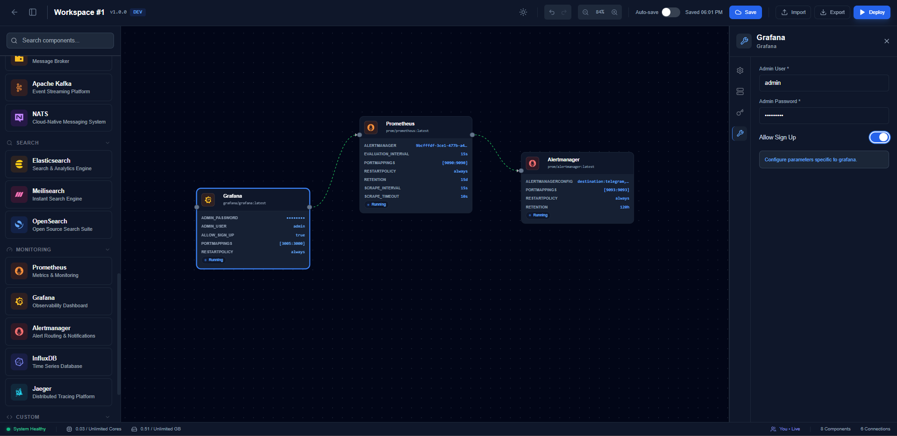
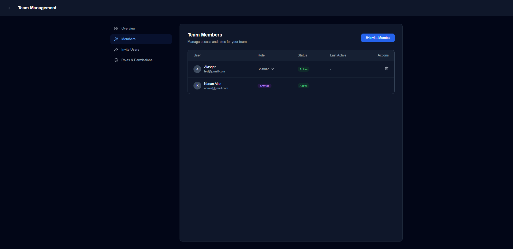

# DevOps Canvas

DevOps Canvas is a **visual infrastructure designer**: drag components onto a canvas, save **workspaces**, and **deploy** them with **Docker** on the machine where the app runs. The stack is a web UI, API, PostgreSQL, Redis, and live updates over WebSockets.

## Screenshots

**Workspaces** — open and manage saved environments from the dashboard.



**Canvas** — compose services, connect them, and configure deployments.





**Team** — roles, invites, and collaboration.



---

## What you need

- **Docker** with **Docker Compose** (`docker compose` command).
- **Git** (to clone this repository).

The server that runs Docker must allow the API container to use the host **Docker socket** so deployments can start containers. That is how the product is intended to work.

---

## Run it with Docker Compose

1. **Clone** the repo and go to its root folder.

2. **Create your config file**

   ```bash
   cp .env.example .env
   ```

   Open `.env` and set at least:

   - **`POSTGRES_PASSWORD`** — a strong database password  
   - **`JWT_SECRET`** — a long random secret (used for sign-in tokens)

   Do not commit `.env`.

3. **Start the stack**

   ```bash
   docker compose up --build
   ```

   To run in the background, add `-d`.

4. **Open the app in a browser**

   - On the same machine: **http://localhost:3000**  
   - The first time, you should be sent to **admin setup** to create the first account. After that, people sign in on the login page or use a team invite link.

The API is also on **port 8080** if you need it (for example health checks at `/health`).

---

## Open the app from another computer (VM, bastion, LAN)

If Compose runs on a server (for example `192.168.0.106`) and you use a browser on your **Windows PC** or laptop, use the server’s address, not `localhost`:

- **http://192.168.0.106:3000** (replace with your real IP or DNS name)

The UI talks to the API **through the same address** (Nginx in the UI container forwards `/api` to the backend). You do not need to point the browser at `localhost:8080` on your PC.

**Checklist**

1. **Firewall / security group** on the server: allow inbound **TCP 3000** (and **8080** only if you want direct API access from outside).
2. **Team invite links** — the link in the email field is built from **`APP_BASE_URL`** in `.env`. If people open the app as `http://192.168.0.106:3000`, set:

   ```env
   APP_BASE_URL=http://192.168.0.106:3000
   ```

   No trailing slash. Restart Compose after changing it.

---

## Stop or reset

```bash
docker compose down          # stop, keep data
docker compose down -v       # stop and delete database volumes (fresh start)
```

---

## Environment variables (short)

| Variable | Required | Purpose |
|----------|----------|---------|
| `POSTGRES_PASSWORD` | Yes | Database password |
| `JWT_SECRET` | Yes | Token signing secret |
| `APP_BASE_URL` | No | URL people use in the browser; used for team invite links (default is localhost) |
| `POSTGRES_USER`, `POSTGRES_DB` | No | See `.env.example` |

More options are described in [`.env.example`](.env.example).

---

## Repo layout

- [`devops-canvas-backend/`](devops-canvas-backend/) — API and deployment logic  
- [`devops-canvas-frontend/`](devops-canvas-frontend/) — Web UI  
- [`docker-compose.yml`](docker-compose.yml) — how the services are wired  

---

## License

Add your license here (for example MIT or Apache-2.0).
